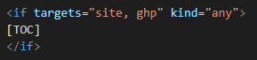

# Использование условий

В **Foliant** можно скрывать или отображать контент в зависимости от условий. Например, контент должен отображаться на сайте, но скрываться в PDF-файле. Подробнее см. в статье [Flags](https://foliant-docs.github.io/docs/preprocessors/flags/).

Чтобы использовать условия :

1. Установите препроцессор `flags`:

    ```
    pip install foliantcontrib.flags
    ```

2. В файле foliant.yml добавьте `flags` в раздел препроцессоров.
3. Добавьте в настройки препроцессора `flags` условия, например:
    
    - `targets:pdf` – для сборки PDF-файлов;
    - `targets:site` – для сборки сайтов;
    - `targets:ghp` – для публикации сайтов на github pages.

4. Добавьте переменную среды `FOLIANT_FLAGS`:

    ```
    FOLIANT_FLAGS="target:site, target:pdf, target:gph"
    ```

5. В MD-файле вставьте блок с условий:

    

6. В блок условий добавьте при необходимости атрибут `kind` с одним из значений:
   
    - `all` - контент отображается, если выполняются все условия;
    - `any` - контент отображается, если выполняется одно из условий;
    - `none` - контент отображается, если не выполняется ни одно из условий.
 