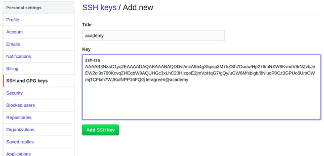

# Подготовка к работе

<if targets="site, ghp" kind="any">
[TOC]
</if>

## Установка Git

1. Скачайте файл инсталлятора с [сайта](https://git-scm.com/download/win) и установите Git.
2. Откройте терминал и введите команду `git --version`. Появится информация об установленной версии Git.

### Настройка Git

1. Откройте терминал и выполните команды:

        git config --global user.name "профиль"
        git config --global user.e-mail`

2. Сгенерируйте SSH-ключ с помощью утилиты Putty. Подробнее см. статью ["Как сгенерировать SSH-ключ для доступа на сервер"](https://community.vscale.io/hc/ru/community/posts/207745269-%D0%9A%D0%B0%D0%BA-%D1%81%D0%B3%D0%B5%D0%BD%D0%B5%D1%80%D0%B8%D1%80%D0%BE%D0%B2%D0%B0%D1%82%D1%8C-SSH-%D0%BA%D0%BB%D1%8E%D1%87-%D0%B4%D0%BB%D1%8F-%D0%B4%D0%BE%D1%81%D1%82%D1%83%D0%BF%D0%B0-%D0%BD%D0%B0-%D1%81%D0%B5%D1%80%D0%B2%D0%B5%D1%80).
3. Откройте профиль на Github и перейдите на страницу "SSH and GPG keys".
4. Нажмите на кнопку **New SSH key**. Откроется страница:

    

5. Укажите имя ключа в поле **Title**.
6. Вставьте ключ в поле **Key**.
7. Нажмите на кнопку **Add SSH key**.

## Установка Foliant и необходимых компонентов

Чтобы установить **Foliant** и необходимые компоненты:

1. Установите [Python](https://www.python.org/downloads/).
2. Установите **Foliant** с помощью pip:

        python -m pip install foliant foliantcontrib.init

3. Установите менеджер пакетов [Chocolatey](https://chocolatey.org/install).
4. Установите **Pandoc** с помощью Chocolatey:

        choco install pandoc

5. Установите **MkDocs**:

        pip install mkdocs

6. Установите [MiKTeX](https://miktex.org/download).
7. Установите [nodejs](https://nodejs.org/en/).
8. Установите MdToPdf с помощью npm:

        npm install -g md-to-pdf

## Создание проекта Foliant

1. В командной строке перейдите в папку, в которой будет создан проект **Foliant**.
2. Создайте проект:

        foliant init

3. Укажите имя проекта, например, "Hello Foliant". Появится сообщение:

        Project "Hello Foliant" created in hello-foliant

Чтобы посмотреть содержимое проекта, выполните команды:

```
$ cd hello-foliant
$ tree
.
├── docker-compose.yml
├── Dockerfile
├── foliant.yml
├── README.md
├── requirements.txt
└── src
    └── index.md
1 directory, 6 files
```

Проект содержит файлы и папки:

- **docker-compose.yml** и **Dockerfile** – файлы,  необходимые для создания проекта в Docker;
- **foliant.yml** – конфигурационный файл проекта;
- **README.md** – файл с информацией о проекте;
- **requirements.txt** – список пакетов Python, необходимых для проекта: бэкенды и препроцессоры, темы для MkDocs и т.д.;
- **src** – папка с исходными файлами проекта. По умолчанию в папке создается файл index.xml.

## Создание репозитория

Чтобы создать репозиторий на <https://github.com/>:

1. Зарегистрируйтесь или войдите в свой аккаунт на <https://github.com/>.
2. Нажмите на кнопку **New** в колонке **Repositories**. Откроется окно:

    

3. Укажите название репозитория в поле **Repository name**.
4. Установите переключатель **Public**.
5. Не устанавливайте флажок **Initialize this repository with a README**.
6. Нажмите на кнопку **Create repository**.
7. Нажмите на кнопку **Upload files** и загрузите файлы проекта.
